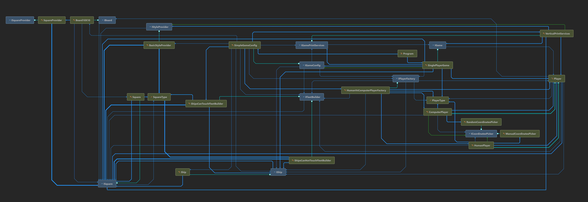

# Table of Contents <!-- omit in toc -->
- [Introduction](#introduction)
- [Game rules in current implementation](#game-rules-in-current-implementation)
- [Other possible game's variations](#other-possible-games-variations)
- [Architectural assumptions](#architectural-assumptions)
- [Responsibilities - Type description](#responsibilities---type-description)
  
# Introduction
This solution lets you play a well known Battleship game usng a predefined configuration.

In order to play, simply build the solution and run MyBattleshipGame.exe from bin/Debug forder.

# Game rules in current implementation
- Game can is played by two players: human and computer.
- Each player will have a random fleet of ships built on a 10x10 board.
- Fleet consist of: 1 Battleship (5 masts) and 2 Destroyers (4 masts).
- Ships masts cannot be placed in a diagonal manner.
- Ships can touch one another but they cannot share a board space (a square).
- Game state along with prompts and notifications is printed vertically on the screen and properly styled.
- Game continous until one of the players have all his ships sunken.

# Other possible game's variations
- Board size can be altered by adding a new implementation of IBoard interface with a different BoardSize value and then passed as a generic parameter to HumanVsComputerPlayerFactory (or consumed completely different under some other setup).
- A different set of players can be obtained by creating a new implementation of IPlayerFactory e.g., enablig human vs human or computer vs computer (which makes no sense but is possible).
- If one wants to change fleet size simply pass a desired tuple to ShipsCanTouchFleetBuilder that can easily build a fleet even twice as big as in official game rules on a 10x10 board.
- Ship "touching" rules can be changed by using a leftover implementation of IFleetBuilder (ShipsCanNotTouchFleetBuilder).
- Both already existing ICoordinatesPickers can have their "salvo" variations if needed (though this would require a slightly different consumption in the game)  
- UI structurecan be changed via IGamePrintServices.
- UI "graphics" can be changed via IStyleProvider

# Architectural assumptions

<i>Fig.1 - Class Diagram in MyBattleship Solution</i>

 
- The majority of dependencies is defined in SimpleGameConfig which sort of serves as a dependency container. Current Game implementation uses this config all over the place (both within SinglePlayerGame.cs and outside of it) but it's off course possible to have one without it.
- All real classes are derived from abstraction (mostly interfaces). In fact all models could be abstract classes for consistency, not only Player, but in this last case it was clearly a more pragmatic approach since there are two implementations and construction logic.
- All models are deprived of any inner logic.
- All logic is encapsulated within dedicated services.
- Generic Interfaces and real classes serve as factories for their generic types (for easier and cleaner object creation)

# Responsibilities - Type description
- Program.cs: Instanciates game config and the game itself. Prompts for user's name that is then passed down the line.
- IGameConfig (SimpleGameConfig): defines a set of dependencies needed to play the game.
- IGame (SinglePlayerGame): 
  - Delegates Playersp creation,
  - Takes care of turns and their outcome, 
  - Observes fleets' conditions and terminates itself when one fleet is fully down,
  - Delegates state printout,
  - Creates notifications.
- IPlayerFactory (HumanVsComputerPlayerFactory): Returns a list of fully equipped players using a generic IBoard type.
- IFleetBuilder (ShipsCanTouchFleetBuilder, ShipsCanNotTouchFleetBuilder - a leftover): Accepts fleedDetails tuple in the constructor and then, in BuildFleet method receives a concrete territory where it tries to fit all the ships while being complient with masts placement and ships' touching rules. Each ship will be build as a result of max 100 attempts during single fleet creation attempt. Fleet creation might be approached up to 1000 times. When exeption is thrown it might be worthwhile reconcidering either board or fleet size or both. Using a reasonable fleet size on a 10x10 board won't cause any problems though. 
- IGamePrintServices (VerticalPrintServices): 
  - Insntanciates a IStyleProvider using a generic parameter and wraps its actions with it,
  - Accepts an entire game in PrintGame method (for paranoia's sake the incoming game could be a cloned instance of the acctual one in order to prevent any possible changes to be done here)
  - Puts required elements vertically and horizontally on the screen, 
  - Prints notifications.
- IStyleProvider (BasicStyleProvider): Applies Console colors and print symbols for all possible elements
- ICoordinatesPicker (ManualCoordinatesPicker, RandomCoordinatesPicker): Called by human and computer player respectively. Encapsulate logic for picking attack coordinates from available territory. The manual one acceps an override Func for testing purposes.
- IBoard (Board10X10): Holds ISquare collection based on its size.
- Player (HumanPlayer, ComputerPlayer): Both implementations are very alike. It's only the PlayerType and ICoordinatesPicker implementation that differs.
- IShip (Ship): A collection of squares.
- ISquare (Square): In addition to a number of rather self explanatory properties it holds information about its neighbours (perpendicular and diagonal) which is vital for fleet creation. 
  